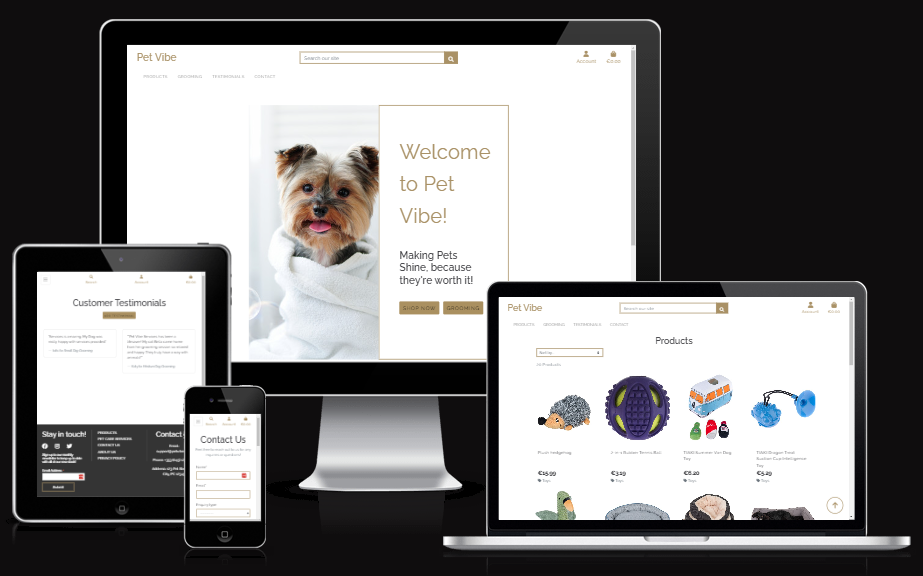
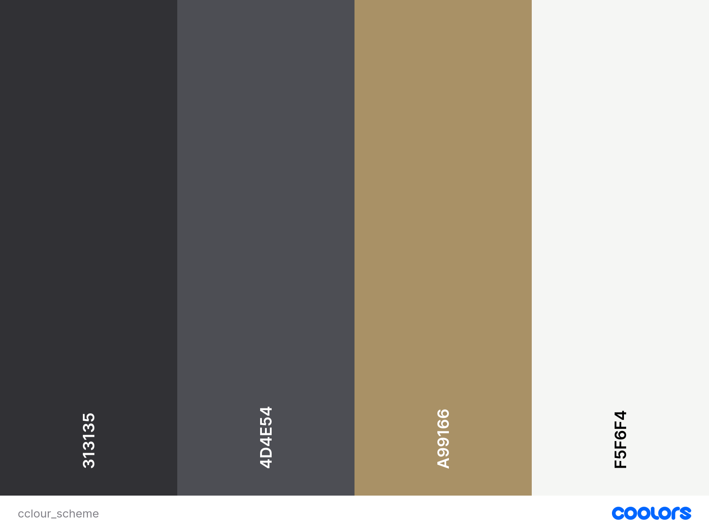

# Pet Vibe

Pet Vibe is a user-friendly B2C platform designed for pet owners to explore and purchase high-quality pet products and services. From grooming services to essential pet products.

The platform also features a secure payment system powered by Stripe. Please note that this website is for educational purposes; do not enter personal credit/debit card details. Test card details provided by Stripe can be used, as documented [here](https://stripe.com/docs/testing#cards).

The live link can be found here - [Pet Vibe](https://pet-vibe-368356973856.herokuapp.com/)



- [User Experience (UX)](#user-experience--ux-)
    * [User Stories](#user-stories)
- [Agile Methodology](#agile-methodology)
- [Agile Methodology](#agile-methodology)
- [Database Schema](#database-schema)
    * [Design](#design)
        + [Colour Scheme](#colour-scheme)
- [Features](#features)
    * [Header](#header)
    * [Home Page](#home-page)
    * [Footer](#footer)
    * [User Account Pages](#user-account-pages)
    * [Profile](#profile)
    * [Products](#products)
    * [Product Detail](#product-detail)
    * [Gromming Services](#gromming-services)
    * [Services management](#services-management)
    * [Bag](#bag)
    * [Checkout](#checkout)
    * [Testimonials](#testimonials)
    * [Error Pages](#error-pages)
- [Languages](#languages)
- [Business Model](#business-model)
- [Marketing Strategy ](#marketing-strategy)
    * [SEO ](#seo)
    * [Email marketing](#email-marketing)
    * [Social media Marketing](#social-media-marketing)
- [Deployment - Heroku](#deployment---heroku)
- [AWS Set Up](#aws-set-up)
- [Forking this repository](#forking-this-repository)
- [Cloning this repository](#cloning-this-repository)
- [Credits](#credits)
- [Acknowledgments](#acknowledgments)

## User Experience (UX)

Pet Vibe is designed with a user-centric approach, ensuring ease of navigation, clear functionality, and seamless engagement for shoppers, pet owners, and site administrators.

### User Stories

### EPIC | Browsing and Navigation
- As a shopper, I can view a list of products so that I can select a product to view.
- As a shopper, I can view product categories so that I can browse the type of products I'm interested in.
- As a site user, I can view a grooming services page so that I can see the types of services available and their prices.
- As a site user, I can access a contact page so that I can submit inquiries or feedback.

### EPIC | User Account and Profile

- As a site user, I can register an account so that I can have a personal profile and save my details.
- As a site user, I can log in or log out so that I can keep my account secure.
- As a site user, I can view my profile page so that I can see my saved information and history.

### EPIC | Purchasing

- As a shopper, I can add products to my shopping bag so that I can purchase multiple items together.
- As a shopper, I can view the contents so that I can see the total price of my shopping bag.
- As a shopper, I can change the quantity of items in my shopping bag so that I can adjust my order.
- As a shopper, I can securely enter my payment details so that I can complete my purchase.

### EPIC | Site Administration

- As a site owner, I can add, edit, or delete products through an interface so that I can maintain the site updated.
- As a store owner, I can approve or delete customer testimonials so that I can control what feedback is shown on the site.
- As a store owner, I can view customer inquiries submitted on the contact page so that I can respond to customer feedback or questions.

### EPIC | User Interaction

- As a site user, I can read testimonials left by other customers so that I can see their feedback on products and services.
- As a site user, I can submit a testimonial after purchasing a product or service so that I can provide feedback.
- As a site user, I can submit a contact form so that I can inquire about products or services.

## Agile Methodology
GitHub Projects was used to manage the development process of the Pet Vibe project, following an Agile approach. This ensured that the project was developed incrementally, with flexibility to adapt to changing requirements and priorities. The project board can be accessed [here](https://github.com/users/thiago-23/projects/15)

## Database Schema

The database schema is designed to efficiently manage data for various functionalities, including user accounts, product details, grooming services, orders, and testimonials. 
During development, SQLite was used for its simplicity. For production, the database was migrated to PostgreSQL on Heroku.
Below is a diagram showing how the tables relate to one another:


### Epics and User Stories

The development process was structured around the 5 main Epics, each representing a significant aspect of the project. These Epics were broken down into smaller, actionable User Stories, allowing for focused and efficient development

### Design

The site uses a warm, welcoming palette inspired by nature, including greens, browns, and neutral tones to evoke trust and comfort.

#### Colour Scheme



## Features

### Header


**Logo**

- Positioned at the top-left, linked to the home page, once click on the Pet Vibe logo it redirect to the home page for ease of navigation for the user.

**Navigation Bar**

- The Navigation bar includes links to key site areas like Products, Grooming, Testimonials and contact and it is visible at the top of every page.

**Search Bar**


- The search bar is prominently positioned above the navigation bar for easy access.
- Users can input keywords, and the search functionality dynamically scans product titles and descriptions, displaying matching results on the product listing page.
- On smaller screens, the search bar transforms into a compact search icon. Clicking this icon reveals the full search bar in a dropdown format.

**User Icon**


- The User icon serves as a navigation link that opens a dropdown menu, providing quick access to account-related actions.
- For visitors who are not logged in, the dropdown includes links to "Register" and "Log In," enabling account creation or authentication.
- After successfully signing in, the dropdown menu dynamically updates, and replacing the "Register" and "Log In" options with a "Log Out" link for easy account management.
- Additionally, the "My Profile" option becomes available in the dropdown menu, allowing users to quickly access and manage their personal account details.


- When a superuser logs in, the User icon dropdown menu dynamically expands to include additional management functionalities tailored for administrative purposes.
- These options include: Product Management and Service Management.
- This expanded functionality ensures that superusers have full control over the platform's content and user interactions, enhancing operational efficiency.

**Bag Icon**


- The Bag Icon, positioned on the right side of the navigation bar beside the User icon, provides quick access to the user's shopping bag.
- When a product is added to the bag:
    - A badge displaying the total quantity of items is dynamically updated and the total appears at the button of the bag icon.
    - A toast notification is triggered in the top-right corner of the screen, confirming the addition of the item.
- The toast includes:
    - A brief snapshot of the bag contents.
    - The current total cost of the items in the bag.
    - This feature enhances the shopping experience by providing real-time feedback and a convenient overview of the user's selections, streamlining the process from browsing to checkout.

### Home Page


- The Home Page of Pet Vibe greets users with a welcoming and engaging call-to-action section, designed to immediately capture attention and guide user interaction.

- The central message, **"Welcome to Pet Vibe! Making Pets Shine, because they're worth it!"**, sets the tone for the site, emphasizing care, quality, and dedication to pets.
- **Shop Now** Button: A prominently placed button encourages users to start exploring and purchasing products right away.
- **Grooming** Services: Another actionable link directs users to view and explore available grooming services and prices.
- This design ensures that the homepage serves as both a welcoming introduction to Pet Vibe and a functional starting point for users to quickly access the site's key offerings

### Footer


- The footer is a consistent element located at the bottom of every page, providing users with easy access to additional features and navigation options.

- Features of the Footer:
    - Social Media Links: Direct links to Facebook, Instagram and Twitter allow users to connect with the platform's social media presence.
    - Newsletter Signup: A Mailchimp-powered subscription form enables users to enter their email address to subscribe to a monthly newsletter, keeping them updated on new products, services, and offers.
    - Quick Links Section: Provides convenient navigation to essential site pages like Contact Us and Privacy Policy.
- External Link Behavior: All external links are designed to open in a new tab, ensuring users remain engaged with the website while exploring additional content.

### User Account Pages

**Sign Up**


**Sign In**


**Log Out**


- Pet Vibe makes managing your account super simple and secure with Django Allauth powering the system. Here’s how it works:

- Sign Up, Log In, and Log Out: Creating an account is quick and easy. Once you're in, you can log in and out anytime you want without hassle.
- Clear Success Messages: Every time you log in or out, you’ll see a quick confirmation message so you know it worked.
- Email Verification: To keep everything secure, you’ll get an email when you sign up. Just click the link in that email to activate your account.
- Forgot Your Password? No Problem! If you ever forget your password, there’s a "Forgot Password" link on the login page. Just click it, and you’ll get an email to reset your password in no time.
- It’s all about making it easy for you to manage your account while keeping your info safe and secure. 😊

### Profile
**Delivery Details**


- The Delivery Details section in your profile keeps your delivery address and phone number saved securely, so you don’t have to type them out every time.
When you’re ready to place an order, your saved details will autofill the delivery form—making the checkout process quick and ease.

**Order History**


- The Order History section keeps track of all your past orders in one list.
- You’ll see details like the order number, the date you placed it, and the total amount.
- If you Want to check something specific? Click on the order number, and it’ll take you to a full summary page with all the details about that order.

### Products


- The Product Listings page is designed to make shopping smooth and fun:
- Each product card gives you the product’s image, title, a short description, and the price.
- If you’re a superuser (like the site admin), you’ll also get handy Edit and Delete buttons at the bottom of each card to manage products directly.
- The layout is fully responsive, meaning the number of products shown in a row adjusts automatically based on your screen size—perfect for desktop, tablet, or mobile browsing.
- Need to find something specific? Use the Sort Box to organize products by price (low to high or high to low) or alphabetically (A-Z).


### Product Detail


- The Quantity Buttons are here to make adjusting your order super simple: Located right under the product details, these buttons let you tweak the number of items you want to add to your bag.
- Use the plus (+) and minus (-) buttons to increase or decrease the quantity. The minus button is disabled if the value hits 1, and the plus button won’t let you go beyond 99—because let’s be real, 99 is plenty!
- If you try to manually type in a number below 1 or over 99, clicking "Add to Bag" will pop up an error letting you know what’s allowed.
- Hit Add to Bag to pop your selected quantity into your shopping bag. Clicking Keep Shopping will take you right back to the store so you can continue browsing.

### Product Management
**Add Product**


- The Add Product Page is a feature specifically for superusers to manage the product catalog:
- Superusers can access this page through the 'Add Product' button, either on the Products page or via the Products Management option in the dropdown menu.
- The SKU field is a stickler to be unique. Duplicate it, and the form won’t submit until you fix it.
- Fields marked with an asterisk (*) are mandatory. Leave them blank or add whitespace, and you’ll see an error message guiding you to fix the issue.
- Restricted Access: Non-superusers attempting to access this page (e.g., by modifying the URL) are redirected to a custom 403 Forbidden page.
- Product Image: While uploading a photo is optional, skipping it means a default image will be used for your product.
- Price Validation: If you go overboard and try adding a price with more than six digits, an error message will flag it.
- Submission: Once all fields are valid, click 'Add Product' to add the item to your catalog. A friendly success message will confirm that product was successfully added.

**Edit Product**


- The Edit Product feature allows superusers to make changes to existing products.
- Superusers can edit products by clicking the edit button on the product card or directly from the product detail page.
- The edit form conveniently loads with all the current details of the product, saving time and reducing the risk of errors.
- The current product image is displayed. If the image needs to be removed, a checkbox is available to revert the image to the default placeholder.
- If a non-superuser attempts to edit a product (e.g., by manipulating the URL), they’re swiftly redirected to a custom 403 Forbidden page.
- After making changes and submitting the form, the superuser receives a clear success message, confirming the product was updated successfully.

**Delete Product**


- The Delete Product feature empowers superusers to efficiently manage the product catalog.
- Superusers can delete a product by clicking the delete button, available on both the product card and the product detail page.
- Before deletion, a confirmation dialog appears, giving the superuser the option to proceed with the deletion or cancel it to prevent accidental removal.
- Once a product is deleted, the superuser receives a clear success message, confirming the product was deleted successfully.

### Gromming Services


- The Grooming Services page is designed to provide users with detailed information about available services.
- Accessible through the navigation bar, ensuring users can find a display and comprehensive list of grooming services.
    - Image: A visual representation of the service.
    - Title: The name of the grooming service.
    - Price: Pricing information for each service.
    - Detailed Description: Additional details about sizesand what the service includes.
- Next to each service, a "Contact Us" button is available, making it easy for users to inquire about specific services. Clicking the button redirects the user to the Contact Form.
- If logged in as a superuser, edit and delete buttons are displayed alongside the service details, allowing for easy management of the grooming service offerings.

### Services Management
**Add Service**


- The Add Service functionality is available for superusers to easily manage grooming services.
- The Add Service page is accessible via the 'Add Service' button on the Services page or from the dropdown menu under Services Management.
- Only superusers can see and use these options. If a non-superuser tries to manually access the page (e.g., by modifying the URL), they are redirected to a custom 403 Forbidden page.
- The form requires all fields marked with an asterisk (*) to be filled out. Leaving these blank or filling them with just whitespace will prompt error messages above the respective fields, guiding the user to fix the issue.
- The option to upload a photo is available. If no photo is uploaded, a default image will be used.
- Once all fields are completed correctly, clicking the 'Add Service' button will create the new service in the database and a success message confirms the service has been successfully added.

**Delete Service**


- Superusers are equipped with the ability to manage and delete services directly from the Services Page.
- Superusers can click the delete button located beside the description of any service on the Services Page.
- Before deletion, the system prompts the superuser with a confirmation dialog to verify their intent. They can either confirm the deletion or cancel the action.
- After successfully deleting a service, a success message appears, confirming that the service has been removed from the platform.

### Bag


- The Shopping Bag Page provides users with a detailed view of the items they've added to their cart.
- Users can navigate to the Shopping Bag page by clicking the bag icon in the navigation bar. This page displays all items currently in the bag, along with their unit price, quantity, and subtotal.

- The quantity input box shows the number of units of a product currently in the bag. Users can adjust the quantity using the plus (+) and minus (-) buttons.
- The minus button is disabled when the quantity is set to 1 to prevent negative quantities.
- The plus button is disabled when the quantity reaches 99 to maintain logical limits.

- Clicking the update icon saves any changes made to the quantity and recalculates the subtotal for that product.
- Clicking the remove button the item will be completely removed from the bag.
- If a user enters an invalid quantity (e.g., a negative number or a number greater than 99) and clicks update, they’ll receive an error message explaining the valid range.
- Entering a negative value and clicking update removes the item from the bag.

### Checkout 


**Details**
- Users are prompted to provide their contact details, delivery address, and card number.
- If shopping as a guest, users are shown a link to create an account or log in for a more personalized experience.
- Signed-in users can check a box to save their delivery information for future use.
- If delivery details are already saved, these fields (including email) are pre-filled to save time.
- Any missing fields, whitespace-only inputs, or invalid data (e.g., text in the phone number field) trigger an error message prompting the user to correct the issue.

**Order Summary**
- Users are presented with a clear breakdown of their order, including: Item quantities, Subtotals and Grand total.
- The order summary title includes the total number of items in the order.
- Clicking on a product’s image in the summary redirects the user to that product’s detail page for further review.

**Payment**
- Payments are securely processed using Stripe, ensuring the user’s sensitive card information is handled safely.
- Invalid card details (e.g., incorrect numbers) immediately trigger an error, preventing incomplete transactions.
- While the payment is being processed, a loading screen ensures users don’t accidentally interrupt the process.
- A warning message at the bottom of the page informs users of the exact amount that will be charged to their card.
- If the payment form fails or the user navigates away during processing, a Stripe webhook ensures the order is still created in the database.
- The webhook double-checks for existing order records and, if necessary, creates them using payment data.

**Confirmation**


- After the payment is processed, users are redirected to a checkout success page, summarizing their completed order.
- Users receive a confirmation email with their order details for future reference.
- A ‘Keep Shopping’ button at the end of the summary takes users back to the Products page, encouraging further browsing.

### Testimonials


- The Testimonials Page is an engaging feature that helps build trust and credibility for Pet Vibe by showcasing feedback from previous clients.
- The page can be accessed through the navigation bar link, making it simple for users to find and view customer reviews.
- Upon navigating to the page, users can view all the testimonials shared by previous clients, organized for easy browsing.
- Each testimonial highlights: The Service it relates to, so potential clients know which service the feedback is about.
- The name of the user who left the feedback, personalizing the testimonials.
- This page enhances user confidence by providing authentic experiences shared by others, showcasing the quality and reliability of services offered by Pet Vibe.

**Add Testimonial**


- The Add Testimonial feature allows users to share their experiences and provide feedback about the services they’ve received.
- Logged-in users can click the "Add Testimonial" button on the Testimonials page to open a simple, user-friendly form where they can submit their feedback.
- The form ensures that sharing a testimonial is quick and straightforward.
- If a user isn’t logged in, attempting to add a testimonial redirects them to the login page, ensuring only authenticated users can contribute feedback.
- After submission, the testimonial is automatically associated with the user's username, and a message informs the user that their testimonial is awaiting admin approval. This ensures that only appropriate and constructive testimonials appear publicly.

**Edit Testimonial**


- The Edit Testimonial feature provides users with the ability to update their feedback while ensuring security and proper access control. 
- Users can edit their own testimonials directly by clicking the edit button under their testimonial on the Testimonials Page.
- The edit form displays the existing testimonial text, making it easy for users to make modifications without starting from scratch.
- Attempts to edit another user’s testimonial via URL manipulation will trigger a custom 403 error page, ensuring testimonials can only be modified by their authors.
- Superusers have the ability to edit any testimonial, enabling them to moderate and maintain content integrity.
- After successfully editing a testimonial, users receive a confirmation message informing them that the update was successful.

**Delete Testimonial**


- The Delete Testimonial feature provides users with the ability to remove their own feedback while ensuring that proper access controls are in place.
- Users can delete their own testimonials by clicking the delete button located under their testimonial on the Testimonials Page.
- Upon clicking the delete button, users are presented with a confirmation dialog to ensure they want to proceed. They can confirm or cancel their action.
- After a testimonial is deleted, users receive a success message confirming that the deletion was successful.
- If a user attempts to delete another user's testimonial via URL manipulation, they encounter a custom 403 error page, ensuring testimonials are only managed by their authors.
- Superusers have the authority to delete any testimonial, allowing them to moderate and manage inappropriate or unwanted content.

### Error Pages


- 400 Bad Request - Pet Vibe is unable to handle this request.
- 403 Page Forbidden - Looks like you're trying to access forbidden content. Please log out and sign in to the correct account.
- 404 Page Not Found - The page you're looking for doesn't exist.
- 500 Server Error - Due to an internal error we are unable to process this request.

## Validator Testing

### HTML
All HTML pages were run through the [W3C HTML Validator](https://validator.w3.org/).


### CSS


### JSHINT


### Lighthouse

Lighthouse was user to validate all pages for accessibility and performance. During the process, fixed several issues, such as improving the contrast between background and text colors. After making these adjustments, the site achieved the following scores:

| Page                           | Performance  | Accessibility | Best Practices  | SEO |
|--------------------------------|:------------:|:-------------:|:---------------:|:---:|
|                                |              |               |                 |     |
| Desktop                        |              |               |                 |     |
| Home                           |           96 |            86 |             100 | 100 |
| Products                       |           94 |            82 |             100 |  91 |
| Product Detail                 |           96 |            82 |             100 | 100 |
| Add Product                    |           95 |            85 |             100 | 100 |
| Edit Product                   |           97 |            85 |             100 | 100 |
| Delete Product                 |           97 |            85 |             100 | 100 |
| Bag                            |           96 |            85 |             100 | 100 |
| Checkout                       |           92 |            82 |             100 |  91 |
| Profile                        |           96 |            85 |             100 | 100 |
| Order History                  |           96 |            85 |             100 | 100 |
| Gromming Services              |           94 |            86 |             100 | 100 |
| Add Gromming Service           |           95 |            85 |             100 | 100 |
| Edit Gromming Service          |           96 |            85 |             100 | 100 |
| Delete Gromming Service        |           96 |            85 |             100 | 100 |
| Testimonials                   |           95 |            85 |             100 | 100 |
| Add Testimonial                |           96 |            85 |             100 | 100 |
| Edit Testimonial               |           96 |            85 |             100 | 100 |
| Delete Testimonial             |           96 |            85 |             100 | 100 |
| Contact                        |           96 |            85 |             100 | 100 |
| Sign In                        |           95 |            85 |             100 | 100 |
| Sign Up                        |           96 |            85 |             100 | 100 |
| Log Out                        |           96 |            86 |             100 | 100 |
| Password Reset                 |           98 |            85 |             100 | 100 |


## Languages

- Python
- HTML5
- CSS3
- Javascript

## Business Model

- Pet Vibe operates with a Business-to-Consumer (B2C) model. The platform provides direct access to high-quality pet grooming services and premium pet care products for pet owners. A typical customer of Pet Vibe is a devoted pet owner who wants the best for their furry friends, whether it’s professional grooming or the latest in pet care essentials.

## Marketing Strategy

- To boost visibility and engagement, Pet Vibe uses a mix of smart marketing strategies, including SEO, content marketing, social media, and email marketing.

### SEO
Several SEO techniques were put in place to ensure Pet Vibe ranks high on search engines, making it easier for users to discover the platform:

**Keywords**
Focused on a combination of short-tail and long-tail keywords that align with the needs of pet owners. Research involved analyzing competitors and tools like WordTracker. Keywords like "premium pet grooming," "quality pet products," and "happy pets" are incorporated into meta tags, page titles, headings, and even <strong> tags to boost relevance.

Meta descriptions and keywords in the HTML header.
Strategically placed in headings, text content, and alt tags for images.
Highlighted in links to improve click-through rates.

**Sitemap and robots.txt**
A sitemap ensures search engines can easily crawl the website, while a well-configured robots.txt file blocks unimportant sections to improve overall SEO performance.

**External Links** 
In the footer, we included links improve credibility and SEO ranking. Search engines see these links as indicators of high-quality conten

### Email Marketing
Pet Vibe’s email marketing strategy focuses on keeping customers informed. There’s a newsletter signup form in the footer powered by Mailchimp, so even casual visitors can stay connected. This approach keeps the audience engaged and loyal over time.

### Social Media Marketing 
A dedicated Facebook business page connects with pet lovers directly. It features a regular updates about new products and grooming services. This organic engagement builds a community and encourages repeat visits to the site.


## Deployment - Heroku

To deploy this page to Heroku from its GitHub repository, the following steps were taken:

### Create the Heroku App:
- Log in to [Heroku](https://dashboard.heroku.com/apps) or create an account.
- On the main page click the button labelled New in the top right corner and from the drop-down menu select "Create New App".
- Enter a unique and meaningful app name.
- Next, select your region.
- Click on the Create App button.

### Attach the Postgres database:
- In the Resources tab, under add-ons, type in Postgres and select the Heroku Postgres option.
- Copy the DATABASE_URL located in Config Vars in the Settings Tab.
- Go back to your IDE and install 2 more requirements:
    - `pip3 install dj_databse_url`
    - `pip3 install psycopg2-binary` 
- Create requirements.txt file by typing `pip3 freeze --local > requirements.txt`
- Add the DATABASE_URL value and your chosen SECRET_KEY value to the env.py file. 
- In settings.py file import dj_database_url, comment out the default configurations within database settings and add the following: 

```
DATABASES = {
    'default': dj_database_url.parse(os.environ.get('DATABASE_URL'))
}
```
- Run migrations and create a superuser for the new database. 
- Create an if statement in settings.py to run the postgres database when using the app on heroku or sqlite if not

```
    if 'DATABASE_URL' in os.environ:
        DATABASES = {
            'default': dj_database_url.parse(os.environ.get('DATABASE_URL'))
        }
    else:
        DATABASES = {
            'default': {
                'ENGINE': 'django.db.backends.sqlite3',
                'NAME': os.path.join(BASE_DIR, 'db.sqlite3'),
            }
    }
```
- Create requirements.txt file by typing `pip3 freeze --local > requirements.txt`
- Create a file named "Procfile" in the main directory and add the following: `web: gunicorn project-name.wsgi:application`
- Add Heroku to the ALLOWED_HOSTS list in settings.py in the format ['app_name.heroku.com', 'localhost']

- Push these changes to Github.

### Update Heroku Config Vars
Add the following Config Vars in Heroku:

|     Variable name     |                           Value/where to find value                           |
|:---------------------:|:-----------------------------------------------------------------------------:|
| AWS_ACCESS_KEY_ID     | AWS CSV file(instructions below)                                              |
| AWS_SECRET_ACCESS_KEY | AWS CSV file(instructions below)                                              |
| DATABASE_URL          | Postgres generated (as per step above)                                        |
| EMAIL_HOST_PASS       | Password from email client                                                    |
| EMAIL_HOST_USER       | Site's email address                                                          |
| SECRET_KEY            | Random key generated as above                                                 |
| STRIPE_PUBLIC_KEY     | Stripe Dashboard > Developers tab > API Keys > Publishable key                |
| STRIPE_SECRET_KEY     | Stripe Dashboard > Developers tab > API Keys > Secret key                     |
| STRIPE_WH_SECRET      | Stripe Dashboard > Developers tab > Webhooks > site endpoint > Signing secret |
| USE_AWS               | True (when AWS set up - instructions below)                                   |

### Deploy
- NB: Ensure in Django settings, DEBUG is False
- Go to the deploy tab on Heroku and connect to GitHub, then to the required repository. 
- Scroll to the bottom of the deploy page and either click Enable Automatic Deploys for automatic deploys or Deploy Branch to deploy manually. Manually deployed branches will need re-deploying each time the repo is updated.
- Click View to view the deployed site.

The site is now live and operational.

## AWS Set Up
### AWS S3 Bucket
- Create an AWS account.
- From the 'Services' tab on the AWS Management Console, search 'S3' and select it.
- Click 'Create a new bucket', give it a name(match your Heroku app name if possible), and choose the region closest to you.
- Under 'Object Ownership' select 'ACLs enabled' and leave the Object Ownership as Bucket owner preferred.
- Uncheck block all public access and acknowledge that the bucket will be public.
- Click 'Create bucket'.
- Open the created bucket, go to the 'Properties' tab. Scroll to the bottom and under 'Static website hosting' click 'edit' and change the Static website hosting option to 'enabled'. Copy the default values for the index and error documents and click 'save changes'.
- Open the 'Permissions' tab, locate the CORS configuration section and add the following code:
```
[
  {
      "AllowedHeaders": [
          "Authorization"
      ],
      "AllowedMethods": [
          "GET"
      ],
      "AllowedOrigins": [
          "*"
      ],
      "ExposeHeaders": []
  }
]
```
- In the 'Bucket Policy' section and select 'Policy Generator'.
- Choose 'S3 Bucket Policy' from the type dropdown.
- In 'Step 2: Add Statements', add the following settings:
    - Effect: Allow
    - Principal: *
    - Actions: GetObject
    - ARN: Bucket ARN (copy from S3 Bucket page)
- Click 'Add Statement'.
- Click 'Generate Policy'.
- Copy the policy from the popup that appears
- Paste the generated policy into the Permissions > Bucket Policy area.
- Add '/*' at the end of the 'Resource' key, and save.
- Go to the 'Access Control List' section click edit and enable List for Everyone (public access) and accept the warning box.

### IAM
- From the 'Services' menu, search IAM and select it.
- Once on the IAM page, click 'User Groups' from the side bar, then click 'Create group'. Choose a name and click 'Create'.
- Go to 'Policies', click 'Create New Policy'. Go to the 'JSON' tab and click 'Import Managed Policy'. 
- Search 'S3' and select 'AmazonS3FullAccess'. Click 'Import'.
- Get the bucket ARN from 'S3 Permissions' as per above.
- Delete the '*' from the 'Resource' key and add the following code into the area:

```
"Resource": [
    "YOUR-ARN-NO-HERE",
    "YOUR-ARN-NO-HERE/*"
]
```

- Click 'Next Tags' > 'Next Review' and then provide a name and description and click 'Create Policy'.
- Click'User Groups' and open the created group. Go to the 'Permissions' tab and click 'Add Permissions' and then 'Attach Policies'.
- Search for the policy you created and click 'Add Permissions'.
- You need to create a user to put in the group. Select users from the sidebar and click 'Add user'.
- Give your user a user name, check 'Programmatic Access'.
- Click 'Next' and select the group you created.
- Keep clicking 'Next' until you reach the 'Create user' button and click that.
- Download the CSV file which contains the AWS_SECRET_ACCESS_KEY and your AWS_ACCESS_KEY_ID needed in the Heroku variables as per above list and also in your env.py.

### Connecting S3 to Django 
- Go back to your IDE and install 2 more requirements:
    - `pip3 install boto3`
    - `pip3 install django-storages` 
- Update your requirements.txt file by typing `pip3 freeze --local > requirements.txt` and add storages to your installed apps.
- Create an if statement in settings.py 

```
if 'USE_AWS' in os.environ:
    AWS_STORAGE_BUCKET_NAME = 'insert-your-bucket-name-here'
    AWS_S3_REGION_NAME = 'insert-your-region-here'
    AWS_ACCESS_KEY_ID = os.environ.get('AWS_ACCESS_KEY_ID')
    AWS_SECRET_ACCESS_KEY = os.environ.get('AWS_SECRET_ACCESS_KEY')

```
- Then add the line 

    - `AWS_S3_CUSTOM_DOMAIN = f'{AWS_STORAGE_BUCKET_NAME}.s3.amazonaws.com'` to tell django where our static files will be coming from in production.


- Create a file called custom storages and import both our settings from django.con as well as the s3boto3 storage class from django storages. 
- Create the following classes:

```
class StaticStorage(S3Boto3Storage):
    location = settings.STATICFILES_LOCATION

class MediaStorage(S3Boto3Storage):
    location = settings.MEDIAFILES_LOCATION
```

- In settings.py add the following inside the if statement:

```
# Static and media files
STATICFILES_STORAGE = 'custom_storages.StaticStorage'
STATICFILES_LOCATION = 'static'
DEFAULT_FILE_STORAGE = 'custom_storages.MediaStorage'
MEDIAFILES_LOCATION = 'media'

# Override static and media URLs in production
STATIC_URL = f'https://{AWS_S3_CUSTOM_DOMAIN}/{STATICFILES_LOCATION}/'
MEDIA_URL = f'https://{AWS_S3_CUSTOM_DOMAIN}/{MEDIAFILES_LOCATION}/

```

- and then add the following at the top of the if statement:
```
AWS_S3_OBJECT_PARAMETERS = {
        'Expires': 'Thu, 31 Dec 2099 20:00:00 GMT',
        'CacheControl': 'max-age=94608000'
}
```

- Go to S3, go to your bucket and click 'Create folder'. Name the folder 'media' and click 'Save'.
- Inside the folder, click 'Upload', 'Add files', and then select all the images that you are using for your site.
- Then under 'Permissions' select the option 'Grant public-read access' and click upload.
- Your static files and media files should be automatically linked from django to your S3 bucket.

## Forking this repository
- Locate the repository at this link [Pet Vibe](https://github.com/thiago-23/Pet-Vibe).
- At the top of the repository, on the right side of the page, select "Fork" from the buttons available. 
- A copy of the repository is now created.

## Cloning this repository
To clone this repository follow the below steps: 

1. Locate the repository at this link [Pet Vibe](https://github.com/thiago-23/Pet-Vibe). 
2. Under **'Code'**, see the different cloning options, HTTPS, SSH, and GitHub CLI. Click the prefered cloning option, and then copy the link provided. 
3. Open **Terminal**.
4. In Terminal, change the current working directory to the desired location of the cloned directory.
5. Type **'git clone'**, and then paste the URL copied from GitHub earlier. 
6. Type **'Enter'** to create the local clone. 

## Frameworks - Libraries - Programs Used

- [Lucidchart](https://lucid.app/documents#/dashboard) - For creating the database schema design.
- [Coolors](https://coolors.co/) - Used to create the site’s color palette.
- [Jshint](https://jshint.com/) - Validated all the JavaScript code.
- [W3C](https://www.w3.org/) - Ensured the HTML and CSS followed web standards.
- [Google Fonts](https://fonts.google.com/) - Brought beautiful fonts into the project.
- [Font Awesome](https://fontawesome.com/) - Added icons for the information bar and buttons.
- [Mailchimp](https://mailchimp.com/?currency=EUR) - Enabled the newsletter signup feature.
- [Privacy Policy Generator](https://www.privacypolicygenerator.info/) - Used to Quickly created the site’s privacy policy.
- [Sitemap Generator](www.xml-sitemaps.com) - Used to generate the sitemap.xml file.
- [Tables Generator](https://www.tablesgenerator.com/markdown_tables) - Turned Excel testing tables into markdown format.
- [Crispy Forms](https://django-crispy-forms.readthedocs.io/en/latest/) - used to Simplified Django form styling.
- [AM I resposive](https://ui.dev/amiresponsive?) - Generated the site mockup images.
- [Favicon](https://favicon.io/) - Greated the site’s favicon.
- [Chrome Dev Tools](https://developer.chrome.com/docs/devtools/) - Used to help test responsiveness and improve performance.
- [Heroku](https://dashboard.heroku.com/login) - Used to deploy the project on a cloud-based platform.
- [Django](https://www.djangoproject.com/) - The main Python framework behind the project.
- [Django-allauth](https://django-allauth.readthedocs.io/en/latest/installation.html) - Managed user authentication and account features.
- [JQuery](https://jquery.com/) - Made interactive elements simpler to code.
- [PostgreSQL](https://www.postgresql.org/) - Hosted the production database.
- [SQLite](https://www.sqlite.org/index.html) - Used as the database during development.
- [Stripe](https://stripe.com/ie) - used for power the secure payment system
- [AWS](https://aws.amazon.com/?nc2=h_lg) - Stored and managed static and media files.

## Credits

- [Code Institute - Boutique Ado Walkthrough Project](https://github.com/Code-Institute-Solutions/boutique_ado_v1)
- [Stack Overflow](https://stackoverflow.com/)
- [Django Docs](https://docs.djangoproject.com/en/5.1/)
- [Bootstrap 4.6 Docs](https://getbootstrap.com/docs/4.6/getting-started/introduction/)
- [Pexels](https://www.pexels.com/):

## Acknowledgments

I want to express my gratitude to The Code Institute Slack community for their quick responses, constructive feedback, and unwavering encouragement, which helped me overcome challenges and improve the project along the way.